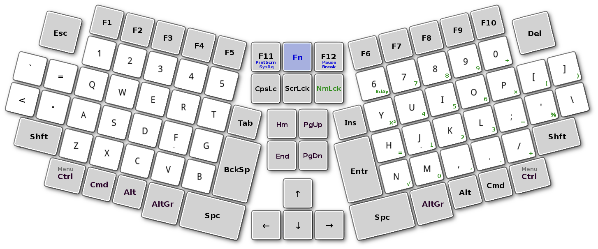
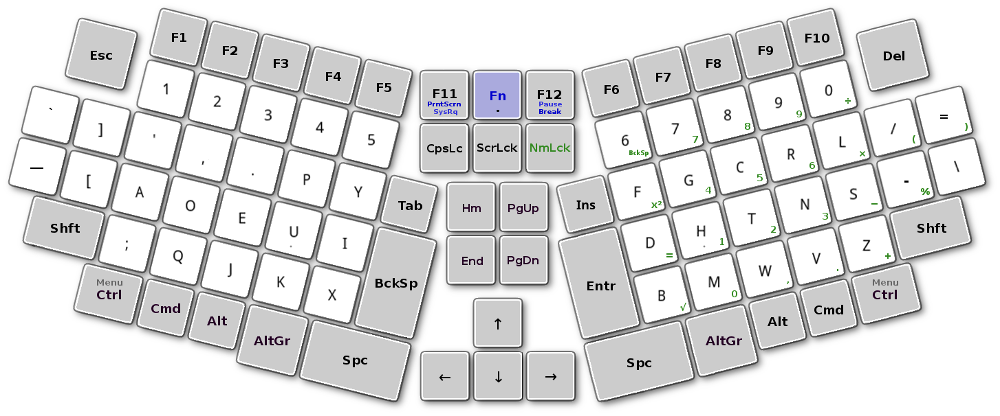
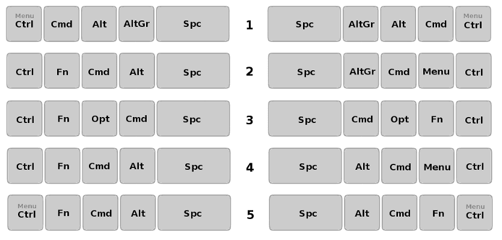
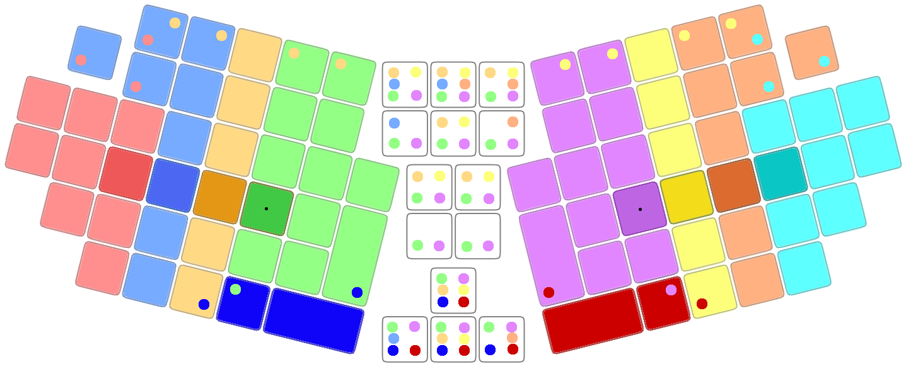
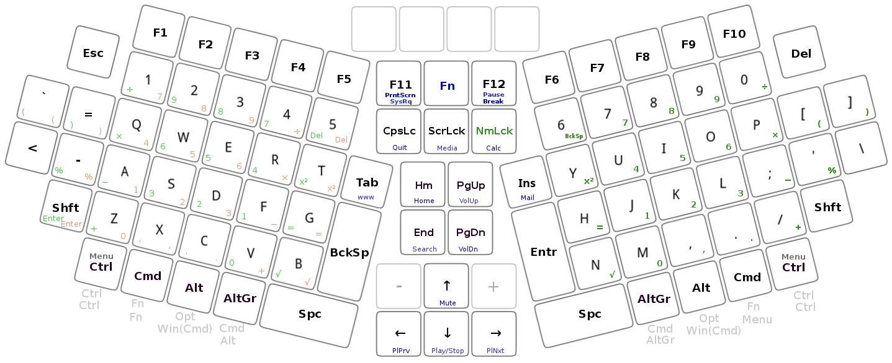
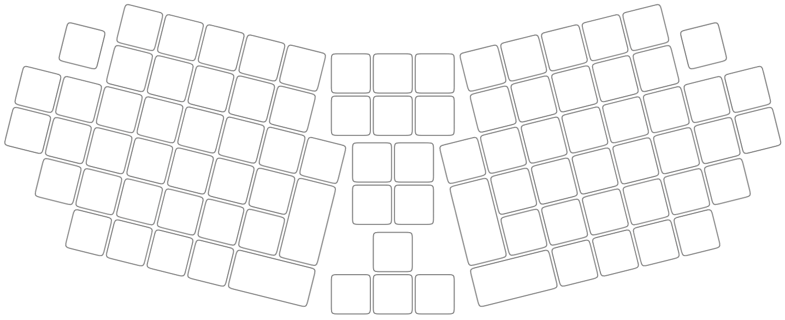

[Skaityti lietuviškai](SKAITYK.md)

-----------------------------------
# STANDARD ERGONOMIC LAYOUT KEYBOARD

_This layout was designed with an aim to remove the defects in the layout of conventional standard computer keyboard._

+ The standard ergonomic layout of the computer keyboard has 90 keys (48 of which are printable character buttons).
+ Left and right sections of the keyboard are tilted 14 ° inwards from the base (keyboard could also be produced with a slightly variable or changeable tilt).
+ SEL Keyboard is suitable for desktop and laptop computers.
+ The user of the keyboard must have option programmatically exchange the keys and save the chosen option.

+ The first image shows the QWERTY layout.

+ The second image shows the Dvorak layout (m-dash added to the free key).

-----------------------------------------------
### Optional sequences for control keys

+ Available options:

  1. SEL Keybord — Fn-F12-F11 + F1 = 1 — (‘Menu’ works by releasing the ‘Control’ button if only one ‘Control’ button is pressed.)
     +  Also interesting modification of the first option with exchanged 'Shift' and 'Alt' or 'Cmd' keys.
  2. PC Keyboard — Fn-F12-F11 + F2 = 2
  3. MacOS Keyboard — Fn-F12-F11 + F3 = 3
  4. PC Keyboard mod 2 — Fn-F12-F11 + F4 = 4
  5. PC Keyboard mod 3 — Fn-F12-F11 + F5 = 5 — (‘Menu’ works by releasing the ‘Control’ button if only one ‘Control’ button is pressed.)

-----------------------------------------------
### SEL Keybord ergonomics

+ Different color keys are assigned to each finger.
+ The circle of the other color shows the possibility of pressing key by another finger.

-----------------------------------------------
### SEL Keyboard with possible additional keys

+ Optional 2, 4 or 6 programmable keys.
+ Optional NumPads are available: right main and left two different (one inverted right).
+ ‘Fn’ level keys are in blue.

-----------------------------------------------
### Key layout

+ With standard size buttons.

-----------------------------------------------
### Improved layout

+ With some enlarged buttons.

-----------------------------------------------

## Compact version of the SEL keyboard layout

Compact layout for a small laptop computer (and etc) when full SEL keyboard (14 cm × 36 cm) does not fit.

+ Compact layout SEL-S (14 cm × 32 cm) for small form factor laptop.

+ Compact layout SEL-XS (14 cm × 30 cm) for extra small form factor laptop.

### Compact folding version

+ Compact split layout SEL-SF (14 cm × 34++ cm) for small form factor folding or split keyboard or as little more compact full SEL version (In this case there is enough for a single Function key.).

-----------------------------------------------

#### Useful links:

[Alternative Keyboard Layouts](http://xahlee.info/kbd/dvorak_and_all_keyboard_layouts.html)
