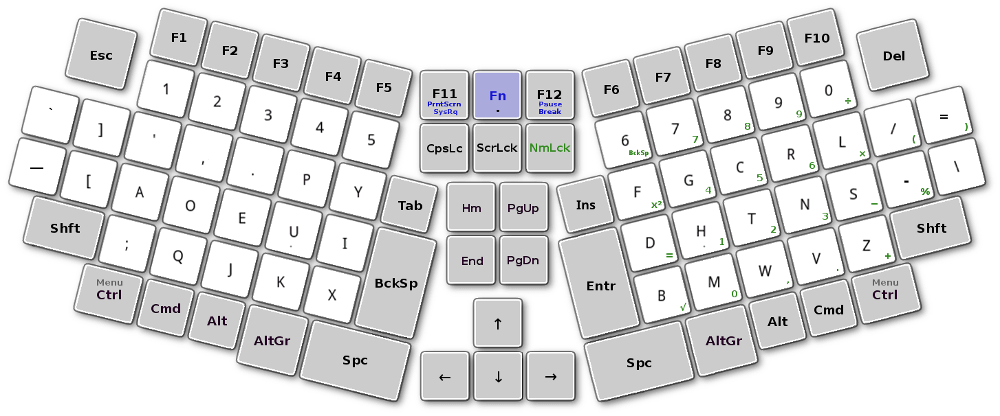
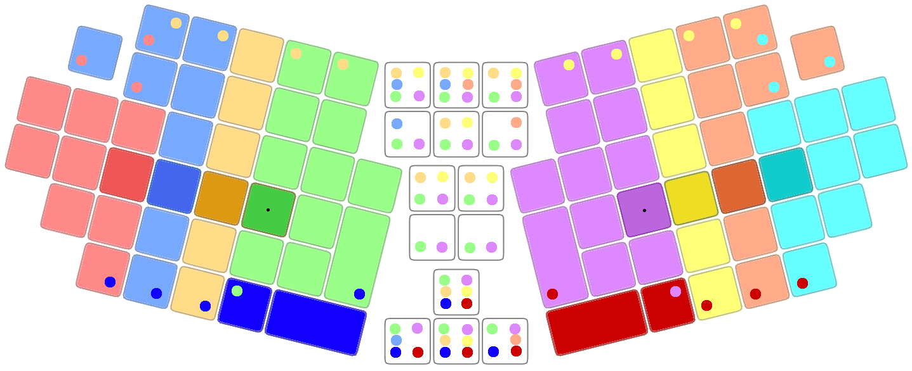
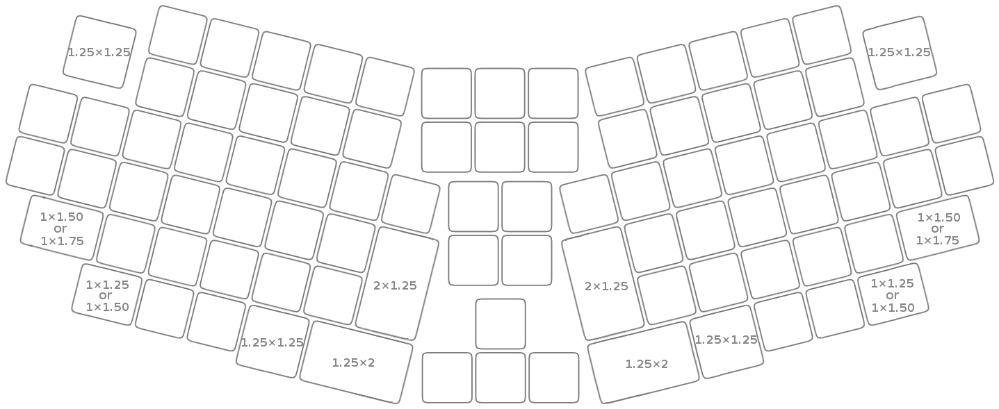

[🇱🇹 Skaityti lietuviškai](SKAITYK.md)

-----------------------------------

# STANDARD ERGONOMIC LAYOUT KEYBOARD
(draft)

_This layout was designed with an aim to remove the defects in the layout of conventional standard computer keyboard._

+ The standard ergonomic layout of the computer keyboard has 90 keys (48 of which are printable character buttons).
+ Left and right sections of the keyboard are tilted 14° inwards from the base (keyboard could also be produced with a slightly variable or changeable tilt).

 

+ The first image shows the QWERTY layout:

 

+ The second image shows the Dvorak layout (m-dash added to the free key):

 

+ Staggered column, even more ergonomic and compact variant:

 

+ SEL Keyboard is suitable for desktop and laptop computers.
+ The user of the keyboard must have option programmatically exchange the keys and save the chosen option.

-----------------------------------------------

## Optional sequences for control keys

+ Available options:

  1. SEL Keybord — Fn-F12-F11 + F1 = 1 — (‘Menu’ works by releasing the ‘Control’ button if only one ‘Control’ button is pressed.)
     +  Also interesting modification of the first option with exchanged 'Shift' and 'Alt' or 'Cmd' keys.
  2. PC Keyboard — Fn-F12-F11 + F2 = 2
  3. MacOS Keyboard — Fn-F12-F11 + F3 = 3
  4. PC Keyboard mod 2 — Fn-F12-F11 + F4 = 4
  5. PC Keyboard mod 3 — Fn-F12-F11 + F5 = 5 — (‘Menu’ works by releasing the ‘Control’ button if only one ‘Control’ button is pressed.)

-----------------------------------------------

## SEL Keybord ergonomics

There are three areas in the keyboard: left — for the left hand; right — for the right hand; and the middle is accessible for both hands.

+ Different color keys are assigned to each finger:

+ The circle of the other color shows the possibility of pressing key by another finger.

-----------------------------------------------

## SEL Keyboard with possible additional keys

+ Optional 2, 4 or 6 programmable keys.
+ Optional NumPads are available: right main and left two different (one inverted right).
+ ‘Fn’ level keys are in blue.

-----------------------------------------------

## SEL Keyboard variant with more keys

-----------------------------------------------

## Key layout

+ With standard size buttons.

-----------------------------------------------

## Improved layout

+ With some enlarged buttons.

-----------------------------------------------

## Addition:

[Compact version of the SEL keyboard](sel-compact-keyboard.md)

-----------------------------------------------

### Useful links:

[Alternative Keyboard Layouts](http://xahlee.info/kbd/dvorak_and_all_keyboard_layouts.html)
