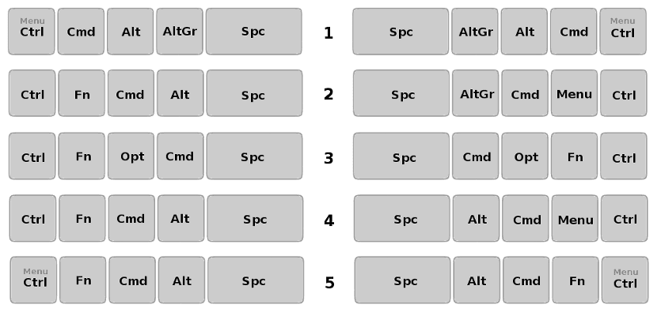

[Read in English](README.md)

-----------------------------------------------
# STANDARTINĖ ERGONOMIŠKO MYGTUKŲ IŠDĖSTYMO KLAVIATŪRA arba PAVYZDINIS TOGINIO MYGTUKŲ IŠDĖSTYMO SPAUDYNAS

_Šiuo išdėstymu siekta pašalinti įprastos standartinės klaviatūros mygtukų išdėstymo trūkumus._

+ Standartinė ergonomiško mygtukų išdėstymo kompiuterio klaviatūra (spaudynas) turi 90 mygtukų (48 iš kurių yra spausdinamųjų ženklų mygtukai).
+ Kairioji ir dešinioji spaudyno skiltys yra pakreiptos 14° į vidų nuo pagrindo (galėtų būti gaminama ir su kiek keičiamu pakreipimo laipsniu).
+ Spaudynas tinka staliniam bei nešiojamam kompiuteriui.
+ Spaudyno naudotojas turėtų turėti galimybę sukeitinėti mygtukus vietomis ir išsaugoti savo parinktis.

+ Pirmame paveikslėlyje SEL klaviatūroje parodytas QWERTY spausdinamųjų ženklų išdėstymas.

+ Antrame paveikslėlyje SEL klaviatūroje — lietuviškas išdėstymas [Ratisė](https://albuck.github.io/Ratise-layout/).

-----------------------------------------------
### Valdiklių parinktiniai eiliškumai

+ Galimos valdiklių eiliškumo parinktys:

  1. SEL Klaviatūra — Fn-F12-F11 + F1 = 1 — (’Meniu’ suveikia atleidžiant ‘Vald‘ mygtuką, jeigu tėra spaudžiamas tik vienas 'Vald' mygtukas.)
   + Dar įdomus būtų pasirinkimas su sukeistais 'Shift' ir 'Alt' mygtukais.
  2. PC Klaviatūra — Fn-F12-F11 + F2 = 2
  3. MacOS Klaviatūra — Fn-F12-F11 + F3 = 3
  4. PC Klaviatūra mod 2 — Fn-F12-F11 + F4 = 4
  5. PC Klaviatūra mod 3 — Fn-F12-F11 + F5 = 5 — (’Meniu’ suveikia atleidžiant ‘Vald‘ mygtuką, jeigu tėra spaudžiamas tik vienas 'Vald' mygtukas.)

-----------------------------------------------
### Spaudyno togė (ergonomika)

+ Atskiro piršto spaudžiamam mygtukui priskirta atskira spalva.
+ Kitos spalvos skrituliukas rodo spaudimo kitu pirštu galimybę.

-----------------------------------------------
### Spaudynas su galimais papildomais mygtukais

+ Yra galimi programuojami papildomi 2, 4 arba 6 mygtukai.
+ Galimi pasirinktiniai skaučiukynės išdėtymai: dešinėje pagrindinis ir kairėje du skirtingi (vienas apverstasis dešinysis).
+ Mėlynais užrašais pažymėti ‘Fn’ lygio mygtukų reikšmės.

-----------------------------------------------
### Spaudyno apmatai

+ Spaudyno apmatai su įprasto dydžio mygtukais.

-----------------------------------------------
### Pagerinto spaudyno apmatai

+ Spaudyno apmatai su padidintais kai kuriais mygtukais.

-----------------------------------------------
## Lietuviški valdymo mygtukų pavadinimai

**Siūlymai:**

- _Alt_ — ⎇ — Kit/Ktp — Kitaip / Kitoks įvedimas — Kitokio įvedimo mygtukas
- _AltGr_ — ⌥ / ⇮ — KitŽ/Lyg3 — Kitoks Ženklas / Trečiasis lygis — Kitokio ženklo įvedimo mygtukas / Trečiojo lygio ženklo įvedimo mygtukas
- _Backspace_ — ⌫ — Trn/Trnt — Trinti — Trynimo atgal mygtukas
- _Caps Lock_ — ⇪ — Did/Didž/DĮ/DRĮ — Didžiosios — Didžiųjų raidžių įjungimas — Didžiųjų raidžių įvedimo įjungimo mygtukas
- _Ctrl_ — ⎈ — Vld/Vald — Valdyti — Valdymo mygtukas
- _Delete_ — ⌦ — Šal/Šlnt — Šalinti — Šalinimo mygtukas
- _End_ — ⇲ — Baig/Bg — Baiga — (Pa)Baigos mygtukas (šičia, manau, reikėtų vengti „pa-“ priešdėlio dėl didesnės pavadinimo atskyros nuo „Prad“).
- _Enter_ — ⏎ / ↵ — Įv — Įvesti — Įvedimo mygtukas
- _Esc_ — ⎋ — Iš — Išeiti — Išėjimo mygtukas
- _F1…_ — V1… — Veikti/Veikimas  1 … — Veikimų mygtukai
- _Home_ — ⇱ — Prad/Pr — Pradžia — Pradžios mygtukas
- _Insert_ — ⎀ (?) — Įt/Įtrp — Įterpti — Įterpimo mygtukas
- _Num Lock_ — ⇭ — Sktm — Skaitmenys — Skaitmenų įjungimo mygtukas
- _Page Down_ — ⎘ / ⇟ — PŽ — Puslapis žemyn — Tolesnio puslapio mygtukas
- _Page Up_ — ⎗ / ⇞ — PA — Puslapis aukštyn — Ankstesnio puslapio mygtukas
- _Pause/Break_ — Prtr — Pertrauka — Pertraukos mygtukas
- _Print Scrn_ — Sp/Spsd — Spausdinti — Spausdinimo mygtukas
- _Scrol Lock_ — ⇳ — Sln/Slnk — Slinkti — Slinkties įjungimo mygtukas
- _Shift_ — ⇧ — Au/Lyg2 — Aukštesnis lygis / Antrasis lygis — Aukštesnio lygio ženklas / Antrojo lygio ženklas
- _Space_ — Trp — Tarpas — Tarpo mygtukas
- _Tab_ — ↹ — At — Atitraukti — Atitraukimo mygtukas

-----------------------------------------------

#### Naudingos nuorodos:

[Lietuviškas ergonomiškas klaviatūros išdėstymas „Ratisė“](https://albuck.github.io/Ratise-layout/)

[Alternative Keyboard Layouts (angliškai)](http://xahlee.info/kbd/dvorak_and_all_keyboard_layouts.html)

