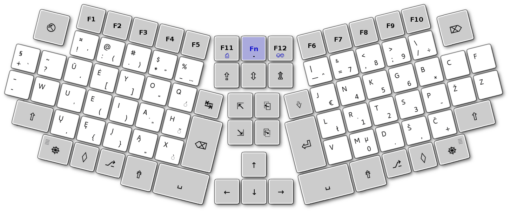

[Read in English](README.md)

-----------------------------------------------
# STANDARTINĖ ERGONOMIŠKO MYGTUKŲ IŠDĖSTYMO KLAVIATŪRA arba PAVYZDINIS TOGINIO MYGTUKŲ IŠDĖSTYMO SPAUDYNAS
(apmatai)

_Šiuo išdėstymu siekta pašalinti įprastos standartinės klaviatūros mygtukų išdėstymo trūkumus._

+ Standartinė ergonomiško mygtukų išdėstymo kompiuterio klaviatūra (spaudynas) turi 90 mygtukų (48 iš kurių yra spausdinamųjų ženklų mygtukai).
+ Kairioji ir dešinioji spaudyno skiltys yra pakreiptos 14° į vidų nuo pagrindo (galėtų būti gaminama ir su kiek keičiamu pakreipimo laipsniu).
+ Spaudynas tinka staliniam bei nešiojamam kompiuteriui.
+ Spaudyno naudotojas turėtų turėti galimybę programiškai sukeitinėti mygtukus vietomis ir išsisaugoti savo parinktis.

+ Pirmame paveikslėlyje SEL klaviatūroje parodytas QWERTY spausdinamųjų ženklų išdėstymas.

+ Antrame paveikslėlyje SEL klaviatūroje — lietuviškas išdėstymas [Ratisė](https://albuck.github.io/Ratise-layout/).

-----------------------------------------------
## Valdiklių parinktiniai eiliškumai

+ Galimos valdiklių eiliškumo parinktys:

  1. SEL Klaviatūra — Fn-F12-F11 + F1 = 1 — (’Meniu’ suveikia atleidžiant ‘Vald‘ mygtuką, jeigu tėra spaudžiamas tik vienas 'Vald' mygtukas.)
     + Dar įdomus būtų pasirinkimas su sukeistais 'Shift' ir 'Alt' ar 'Cmd' mygtukais.
  2. PC Klaviatūra — Fn-F12-F11 + F2 = 2
  3. MacOS Klaviatūra — Fn-F12-F11 + F3 = 3
  4. PC Klaviatūra mod 2 — Fn-F12-F11 + F4 = 4
  5. PC Klaviatūra mod 3 — Fn-F12-F11 + F5 = 5 — (’Meniu’ suveikia atleidžiant ‘Vald‘ mygtuką, jeigu tėra spaudžiamas tik vienas 'Vald' mygtukas.)

-----------------------------------------------
## Spaudyno togė (ergonomika)

Klaviatūroje yra išskirtinos trys sritys: kairė — kairiajai rankai; dešinė — dešiniajai rankai; o vidurinė yra prieinama abiejoms rankoms.

+ Atskiro piršto spaudžiamam mygtukui priskirta atskira spalva:

+ Kitos spalvos skrituliukas rodo spaudimo kitu pirštu galimybę.

-----------------------------------------------
## Spaudynas su galimais papildomais mygtukais

+ Yra galimi programuojami papildomi 2, 4 arba 6 mygtukai.
+ Galimi pasirinktiniai skaičiukynės išdėstymai: dešinėje pagrindinis ir kairėje du skirtingi (vienas apverstasis dešinysis).
+ Mėlynais užrašais pažymėti ‘Fn’ lygio mygtukų reikšmės.

-----------------------------------------------
## Spaudyno apmatai

+ Spaudyno apmatai su įprasto dydžio mygtukais.

-----------------------------------------------
## Pagerinto spaudyno apmatai

+ Spaudyno apmatai su padidintais kai kuriais mygtukais.

-----------------------------------------------

## Paslinkti stulpeliai

+ SEL su paslinktais stulpeliais.

-----------------------------------------------

## Papildymai:

[Glaustas SEL spaudyno išdėstymas](sel-glausta-klaviatura.md)

[Standartinė ergonominė klaviatūra su skersuotai išdėstytais mygtukais](sel-klaviatura-skersuoti-mygtukai.md)

[Lietuviški valdymo/keitimo mygtukų pavadinimai](klaviaturos-mygtuku-pavadinimai.md)

-----------------------------------------------

### Naudingos nuorodos:

[Lietuviškas ergonomiškas klaviatūros išdėstymas „Ratisė“](https://albuck.github.io/Ratise-layout/)

[Lietuviška ergonomiška klaviatūra LEKP](https://lekp.info/)

[Lietuviškų klaviatūros išdėstymų palyginimas](https://albuck.github.io/lithuanian-keyboard-layouts/)

[Klaviatūros išdėstymai (lietuvybė.lt)](http://lietuvybė.lt/standartai/klaviat%C5%ABros-i%C5%A1d%C4%97stymai/)

[Alternative Keyboard Layouts (angliškai)](http://xahlee.info/kbd/dvorak_and_all_keyboard_layouts.html)

