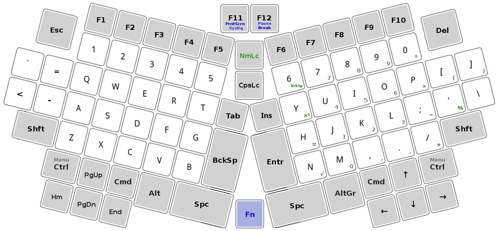
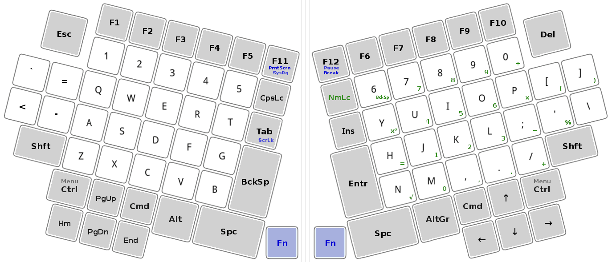

# Compact version of the SEL keyboard layout

The compact layout for a small laptop computer (and etc) when a full SEL keyboard (14 cm × 36 cm) does not fit.

+ Compact layout SEL-S (14 cm × 32 cm) for a small form factor laptop.

+ Compact layout SEL-XS (14 cm × 30 cm) for an extra small form factor laptop.

## Compact folding version

+ Compact split layout SEL-SF (14 cm × 34++ cm) for a small form factor folding or a split keyboard or as a little more compact SEL version.

-----------------------------------------------

[To the top](README.md)

