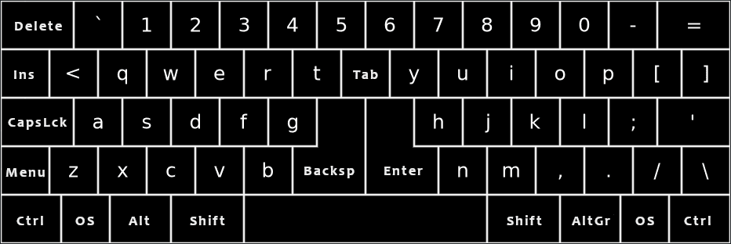

# Standartinė ergonominė klaviatūra su skersuotai išdėstytais mygtukais

Tai glaustas klaviatūros išdėstymas. Jis užima tiek pat vietos kiek ir tradicinė klaviatūra, plius papildomi du mygtukai. Klaviatūra visiškai simetriška kairės—dešinės pusių atžvilgiu. Klaviatūra apima ISO klaviatūros spausdinamųjų ženklų aibę (t. y. turi 105-tą mygtuką).

Siekta daryti tik svarbiausius ir minimalius pakeitimus šalinant tradicinės klaviatūros trūkumus.

-----------------------------------------------

[Į pagrindinį puslapį](SKAITYK.md)

